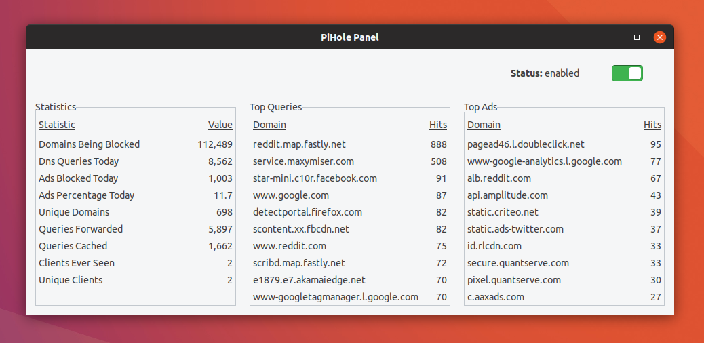
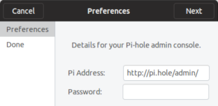

# PiHole-Panel



PiHole-Panel 1.6 COMING SOON
- Update notification
- More helpful error messages

PiHole-Panel 1.5
- Truncated URLs over 36 characters
- Updated icon

PiHole-Panel 1.4
- Implemented validation for setup
- Now works with admin console password 

PiHole-Panel is a realtime statistics and control panel for Pi-hole Ad blocker 

Install/Update:
```
sudo apt install python3-gi
```
```
sudo sh ./setup.sh
```

Uninstall:
```
sudo sh ./uninstall.sh
```

Troubleshoot:
```
rm ~/.config/pihole_panel_configs.xml
```
