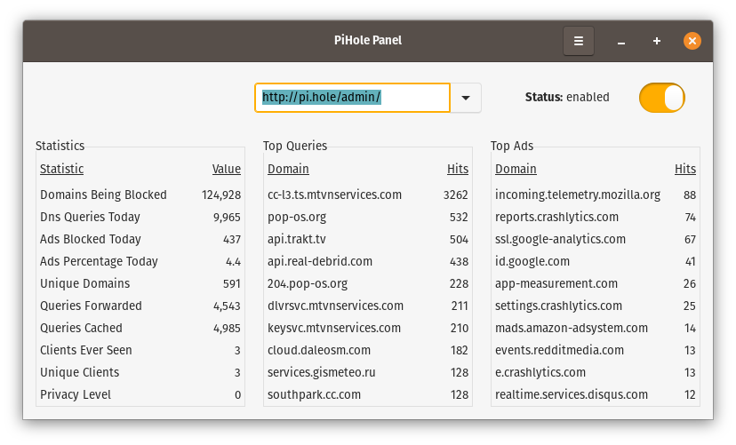

# PiHole-Panel
Connects to one or multiple Pi-hole hosts and reports statistics in real-time and also allows you to use it as a control panel to control your Pi-hole hosts independently. 

This program will run on your Pi or desktop computer that is running Raspian, Ubuntu, Pop_OS!, Debian etc...



## Install/Update
```
1. You must use a password with your Pi-hole otherwise the API becomes read-only.
2. Download pihole-panel-latest.deb from above.
3. Open Terminal
```
```
cd ~/Downloads
sudo dpkg -i pihole-panel-latest.deb
```

**Alternatively,** Ubuntu, Pop_OS!, and more [experimental](https://raspberrypi.stackexchange.com/questions/44622/how-to-add-ppa-entries-manually-on-raspberry-pi) Raspbian users can use the Ubuntu PPA:
```
sudo add-apt-repository ppa:daleosm/pihole-panel
sudo apt update
sudo apt install pihole-panel
```

## Troubleshoot
```
rm ~/.config/pihole_panel_configs.xml
```

## Uninstall
```
sudo apt remove pihole-panel
```

## Changelog
PiHole-Panel 2.8
-  Issue with reuploading to PPA.

PiHole-Panel 2.7
-  Set win resizable to false.

PiHole-Panel 2.6
-  Fixed alignment for settings items with some themes.

PiHole-Panel 2.5
- Settings window is now centered.
