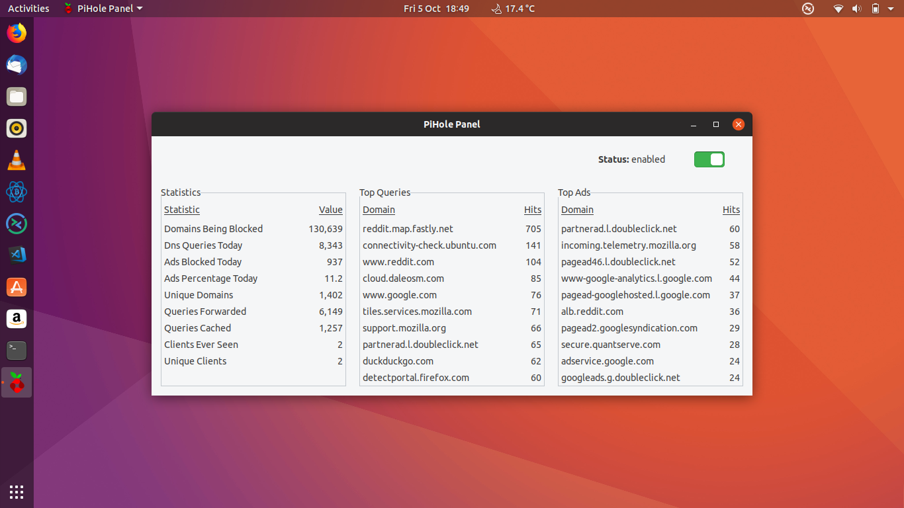

# PiHole-Panel
PiHole-Panel is a statistics and control panel for Pi-hole and optimised for the Gnome desktop.



PiHole-Panel 1.0

Install:
```
You may require sudo apt install python3-gi
```
```
sudo sh ./setup.sh
```

Uninstall:
```
sudo sh ./uninstall.sh
```

Troubleshoot:
```
rm ~/.config/gtk_assistant_configs.xml
```